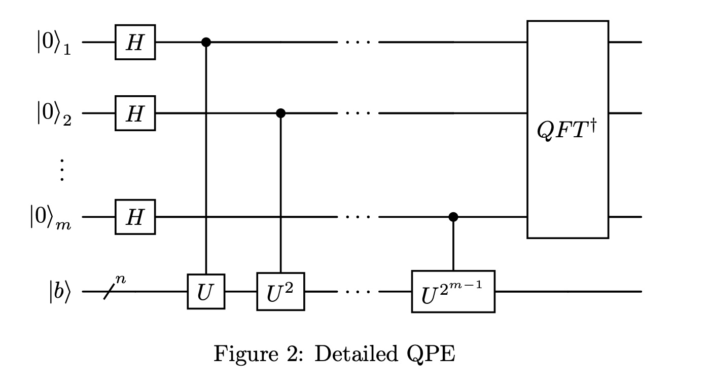

# Spring 2024: Final Project
## Notations
We denote $|i\rangle$ the state in the computational basis corresponding to the binary decomposition of $i$. For example, with 4 qubits, $|5\rangle = |0101\rangle$.

## The HHL Algorithm
The HHL (Harrow-Hassidim-Lloyd) algorithm is a quantum algorithm designed to solve systems of linear equations. Given a matrix $A \in \mathbb{C}^{2^n \times 2^n}$ and a vector $\mathbf{b} \in \mathbb{C}^{2^n}$, we want to find a vector $\mathbf{x} \in \mathbb{C}^{2^n}$ that verifies
$$A \mathbf{x} = \mathbf{b}.$$
The HHL algorithm is exponentially faster than classical methods when the matrix $A$ is sparse. If $s$ is the number of non-zero elements per row in $A$, then the quantum circuit can be constructed with $O(n s^2)$ gates whereas the best classical algorithm runs in $O(2^n s)$.
To solve the linear system $A \mathbf{x} = \mathbf{b}$ with a quantum circuit, we need to represent $\mathbf{b}$ and $\mathbf{x}$ by quantum states; thus, we need to scale them to unit length $||\mathbf{b}|| = ||\mathbf{x}|| = 1$. Then $\mathbf{b}$ can be represented by a state $|b\rangle$ using $n$ qubits such that $|b\rangle = \sum_{i=0}^{2^n-1} b_i |i\rangle$. Here, the $b_i$ are the components of $\mathbf{b}$. The vector solution $\mathbf{x}$ can be then represented by the state $|x\rangle$ that verifies
$$|x\rangle = c A^{-1} |b\rangle, \quad c^{-1} = ||A^{-1} |b\rangle||$$
where $c$ ensures that the state is normalized.
The HHL algorithm uses quantum phase estimation to encode the solution $\mathbf{x}$ into a quantum state. To do so, the algorithm requires that the matrix $A$ be Hermitian.

Question Theory 1: Show that if $A$ is not Hermitian, we can still find a solution to the system by running the HHL algorithm on the larger system:

$$\bar{A} = \begin{pmatrix}0 & A \\\ A^{\dagger} & 0\end{pmatrix}, \quad \bar{b} = \begin{pmatrix}b \\\ 0\end{pmatrix}.$$

So, from now on, we will assume that $A$ is a Hermitian matrix, i.e., $A = A^{\dagger}$. Thus, by the spectral theorem (see Homework 1 Ex 3), there exists a set of orthogonal states ${|u_i\rangle}_{i=0,\ldots,2^n-1}$ such that $A$ can be written

$$A = \sum_{i=0}^{2^n-1} \lambda_i |u_i\rangle \langle u_i|$$

where the $\lambda_i \in \mathbb{R}$ are the eigenvalues of $A$. The ${|u_i\rangle}{i=0,\ldots,2^n-1}$ form an eigenbasis of $A$. The state $|b\rangle$ can also be written in the ${|u_i\rangle}{i=0,\ldots,2^n-1}$ basis and we denote

$$|b\rangle = \sum_{i=0}^{2^n-1} \beta_i |u_i\rangle.$$

Question Theory 2: Check that $|x\rangle = c \sum_{i=0}^{2^n-1} \frac{\beta_i}{\lambda_i} |u_i\rangle$ is a solution to the system.

## The Circuit
The HHL circuit is represented in below. The circuit uses three registers:

- The top register is 1 ancilla qubit initialized to $|0\rangle$.
- The middle register is a memory register that stores the eigenvalues $\lambda_i$ of $A$. More precisely, we will store the binary representation of $\lambda_i$. The number of qubits $m$ needed for this register will therefore depend on $\lambda_i$. This register is initialized to $|0\rangle^{\otimes m}$.
- The bottom register uses $n$ qubits and is initialized with the state $|b\rangle$.

The circuit is composed of 4 steps: a quantum phase estimation (QPE), a controlled rotation, an inverse quantum phase estimation, and a measurement. Let us detail the gates appearing in each part:

Quantum phase estimation: This part of the circuit is detailed in Figure below. The circuit starts with a Hadamard gate on each qubit of the memory register. The unitary $U$ is

$$U = e^{i 2 \pi \frac{A}{2}}.$$

Then we apply an inverse quantum Fourier transform on the memory register:

$$QFT^{\dagger} |k\rangle = \frac{1}{\sqrt{2^m}} \sum_{j=0}^{2^m-1} e^{-i 2 \pi \frac{k j}{2^m}} |j\rangle.$$

Controlled rotation: The gate $R$ realizes the transformation

$$R(|0\rangle \otimes |\lambda\rangle) = \left( \sqrt{1 - \frac{1}{\lambda^2}} |0\rangle + \frac{1}{\lambda} |1\rangle \right) \otimes |\lambda\rangle.$$

Inverse QPE: We apply the inverse gates of the QPE in reverse order to set back the memory register to $|0\rangle^{\otimes m}$. The memory register is no longer entangled with the output register.

Measurement: The algorithm outputs $|x\rangle$ if the ancilla qubit is measured in state $|1\rangle$.

## Analysis
We assume that the eigenvalues of $A$ are positive integers, i.e., $\lambda_i \in \mathbb{N}^*$ and $\max_i(\lambda_i) < 2^m$. The circuit starts with a quantum phase estimation that stores the eigenvalues in the memory register.

Question Theory 3: Show that the state $|\phi_1\rangle$ defined in Figure 1 is
$$|\phi_1\rangle = |0\rangle \otimes \left( \sum_i \beta_i |\lambda_i\rangle \otimes |u_i\rangle \right).$$
Hint: Use the lecture notes on QPE. You can start by answering these questions:

- What are the eigenvalues and eigenvectors of $U$?
- What happens if $|b\rangle = |u_i\rangle$?

Then we apply a controlled rotation $R$ to create the $\frac{1}{\lambda}$ factor.

Question Theory 4: Compute $|\phi_2\rangle$.

We want to disentangle the memory register from the output state. Thus, we apply the inverse QPE.

Question Theory 5: Show that the state $|\phi_3\rangle$ defined in Figure 1 is

$$|\phi_3\rangle = \sum_i \beta_i \left( \sqrt{1 - \frac{1}{\lambda_i^2}} |0\rangle + \frac{1}{\lambda_i} |1\rangle \right) \otimes |0\rangle^{\otimes m} \otimes |u_i\rangle.$$

Hint: Start with $|b\rangle = |u_i\rangle$ and use the fact that gates are unitary.

Question Theory 6: Show that the output of the circuit is a solution of the linear system if the result of the measurement is "1". What is the probability of obtaining this result? Use $\max_i(\lambda_i) < 2^m$ to lower bound this result.

Question Implementation 1: Implement the HHL circuit on a simulator. Consider only the case where the eigenvalues of $A$ are powers of 2. More detailed instructions are given in the notebook.

## Measuring the Solution
We want to measure $|x\rangle$ to learn its value. We are used to measuring states with projectors. The probability of a state $|\phi\rangle$ to be in state $|\psi\rangle$ is

$$P(|\psi\rangle) = \langle \phi | (|\psi\rangle \langle \psi|) | \phi \rangle = |\langle \phi | \psi \rangle|^2.$$

Question Implementation 2: On a simulator and a real device, run the HHL circuit to measure $|x\rangle$, the solution of the system

$$A = \frac{1}{2} \begin{pmatrix}3 & 1 \\\ 1 & 3\end{pmatrix} \text{ and } |b\rangle = \frac{1}{\sqrt{3}} (2 |0\rangle - |1\rangle).$$

Compare it to the expected solution $\frac{A^{-1} \mathbf{b}}{||A^{-1} \mathbf{b}||}$. What is missing to fully reconstruct the solution?

## Limitations
Although the HHL algorithm offers exponential speedup over classical methods, it has several limitations:

- It requires that the matrix $A$ be sparse to reach the announced complexity. In our implementation, we do not pay attention to this requirement.
- We need to have some a priori knowledge of the eigenvalues $\lambda_i$ to have an exact and efficient algorithm.
- The algorithm only gives a solution with some probability of error.
- The preparation of the quantum state for $|b\rangle$ is often difficult and requires additional resources.
- We do not have direct access to the result. We still need to measure $|x\rangle$ to learn the solution.
- On a real quantum noisy device, we will only have access to an approximate solution.

## Bonus - Another Measurement
If we measure our state $|x\rangle$ only in the computational basis, which means that we choose the set of projectors $|i\rangle \langle i|$, we will only obtain the norm of each amplitude in the computational basis. If the amplitude is complex, we will not be able to reconstruct the full state $|x\rangle$. Thus, we need another kind of measurement.

An observable $O$ is a Hermitian matrix that represents a physical property we want to measure in our system. It can be the position, momentum, spin, etc. We are interested to know the average value of that property. As a Hermitian matrix, $O$ can be decomposed into its eigenbasis, $O = \sum_k \mu_k |v_k\rangle \langle v_k|$. The expected value of $O$ observed in the state $|\phi\rangle$ is then

$$\langle O \rangle = \langle \phi | O | \phi \rangle = \sum_k \mu_k \langle \phi | |v_k\rangle \langle v_k| | \phi \rangle = \sum_k \mu_k P(|v_k\rangle).$$

Remark that if we choose $O$ to be a projector $|\psi\rangle \langle \psi|$, then $O$ has only one non-zero eigenvalue which is 1 associated with the eigenvector $|\psi\rangle$. Therefore, the expected value of $O$ is $P(|\psi\rangle)$.

We focus on the case where $A$ is a $2 \times 2$ matrix and $\mathbf{b}$ is a vector of size 2. We denote by $\rho$ the matrix $\rho = |x\rangle \langle x|$. The set of operators $P = \frac{1}{\sqrt{2}} { I, X, Y, Z }$ is a basis of the space of the $2 \times 2$ matrices. Thus, we can decompose $\rho$ in this basis:

$$\rho = \frac{c_I I + c_X X + c_Y Y + c_Z Z}{\sqrt{2}}.$$

Question Theory 7: Show that $c_\sigma = \text{Tr}(\rho \sigma)$ for all $\sigma \in P$.

Hint: Show that for all $\sigma_i, \sigma_j \in P$, $\text{Tr}(\sigma_i \sigma_j) = 0$ if $j \neq i$ and 1 if $i = j$.

Pauli matrices are Hermitian and can be interpreted as observables. Therefore, by measuring each operator $\sigma \in P$, we can have access to their expected value $\langle \sigma \rangle = \langle x | \sigma | x \rangle = \text{Tr}(\langle x | \sigma | x \rangle) = \text{Tr}(\rho \sigma)$, and we can reconstruct the density matrix $\rho$:

$$\rho = \frac{\langle I \rangle I + \langle X \rangle X + \langle Y \rangle Y + \langle Z \rangle Z}{\sqrt{2}}.$$

Question Implementation 3: Run your HHL circuit on a simulator and a real quantum device and reconstruct completely the solution state for the system defined as

$$A = \frac{1}{9} \begin{pmatrix}13 & 2 + i 4 \\\ 2 - i 4 & 14\end{pmatrix} \text{ and } |b\rangle = \frac{1}{\sqrt{2}} (|0\rangle + i |1\rangle).$$

Observable measurements will be detailed in the notebook.
